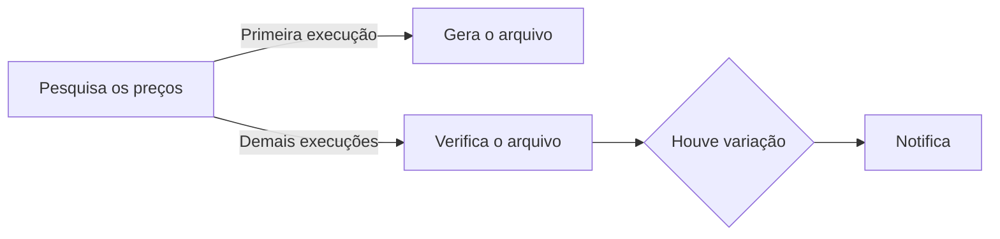

# Vespa

Bot do telegram p/ enviar msg cada vez que um ativo "sobe" ou "desce".

Passo 1:
- Criar um bot no telegram:
  - Para criá-lo, abra seu app do Telegram, busque por: **@BotFather**.
  - Envie o comando: **/newbot** e segue o baile até gerar um token.

Passo 2:
- Criar um canal no telegram; (CANAL, não um grupo)
- Adicionar o bot como ADMINISTRADOR do canal.

Passo 3:
 - Clonar o repositório e dar o comando:
``
pip install -r requirements.txt
``

Passo 4:
 - Preencher no arquivo 2telegram.py:
   - nome do canal; ``CHANNEL_NAME ``
   - token do bot;     ``TOKEN_TELEGRAM ``

Passo 5:
 - Rodar o código:
```python 2telegram.py```
 
OBS: Se for pra rodar o dia todo tem que colocar no crontab ou equivalente;



